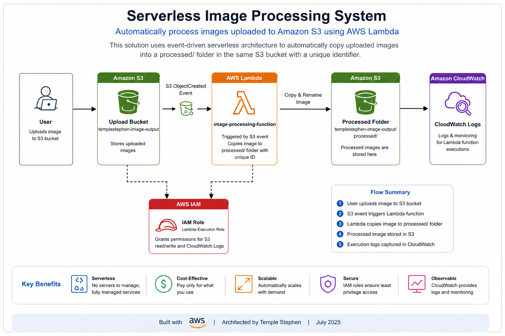
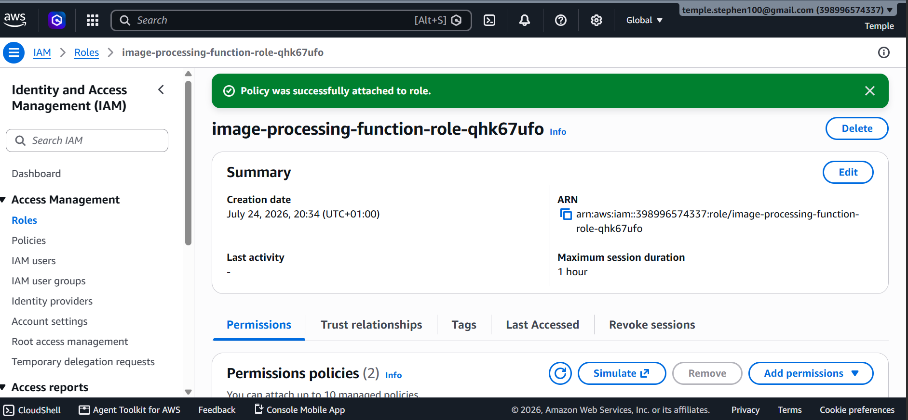
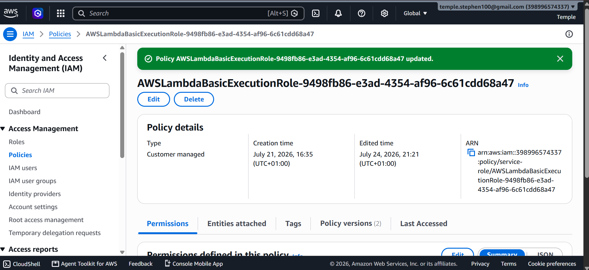
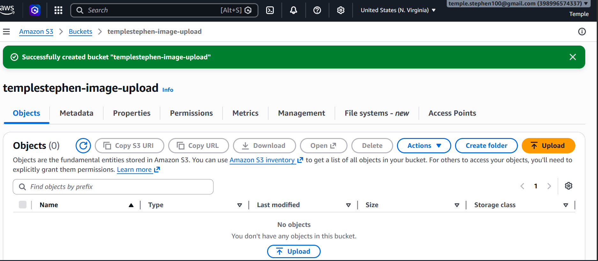
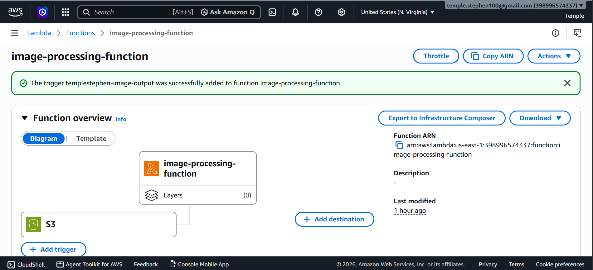
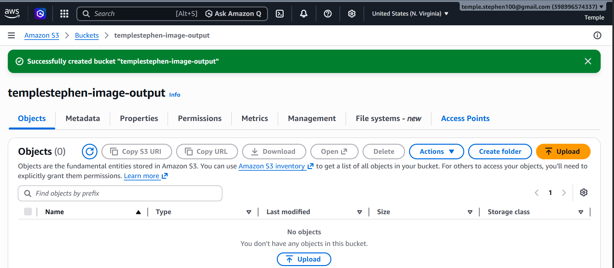

<div align="center">

# ⚡ Serverless Image Processing Pipeline

### *Upload an image to S3. Everything else happens on its own.*

**[📂 Repository](https://github.com/TempleStephen/serverless-image-processing)** &nbsp;•&nbsp; **[💼 LinkedIn](https://www.linkedin.com/in/temple-stephen-74664a1b3/)** &nbsp;•&nbsp; **[🚀 Deployment Guide](#deployment-guide)**

<br>


</div>

---

An event-driven serverless image processing pipeline built with **AWS Lambda**, **Amazon S3**, **IAM**, **CloudWatch**, and **Python**.

---


## Table of Contents

- [Overview](#overview)
- [Architecture](#architecture)
- [AWS Services Used](#aws-services-used)
- [Workflow](#workflow)
- [Project Structure](#project-structure)
- [Deployment Guide](#deployment-guide)
- [Screenshots](#screenshots)
- [Example Execution](#example-execution)
- [Features](#features)
- [Skills Demonstrated](#skills-demonstrated)
- [Future Improvements](#future-improvements)
- [Author](#author)

---

## Overview

This project demonstrates an event-driven serverless architecture on AWS. Whenever a user uploads an image to an Amazon S3 bucket, AWS automatically triggers a Lambda function that generates a unique filename with a UUID, copies the image into a `processed/` folder, and records execution details in Amazon CloudWatch Logs.

It's a practical, end-to-end example of serverless computing, IAM permission management, and event-driven automation on AWS.

---

## Architecture



---

## AWS Services Used

| Service | Purpose |
|---|---|
| Amazon S3 | Stores uploaded and processed images |
| AWS Lambda | Processes uploaded files |
| IAM | Manages Lambda execution permissions |
| Amazon CloudWatch | Captures execution logs and metrics |
| Python 3.13 | Lambda runtime |
| Boto3 | AWS SDK for Python |

---

## Workflow

1. **Upload** — A user uploads an image to the S3 bucket.
2. **Event** — S3 generates an `ObjectCreated` event.
3. **Trigger** — The event automatically invokes the Lambda function.
4. **Generate** — Lambda generates a unique identifier (UUID) for the file.
5. **Process** — The image is copied into the `processed/` folder under its new key.
6. **Log** — CloudWatch records the execution for monitoring and troubleshooting.

---

## Project Structure

```text
serverless-image-processing/
│
├── architecture/
│   └── ArchitectureDiagram.png
│
├── lambda/
│   └── lambda_function.py
│
├── screenshots/
│   ├── Policy.png
│   ├── Policy to role.png
│   ├── Lambad function role.png
│   ├── AmazonS3FullAccess.png
│   ├── Buckets.png
│   ├── File upload.png
│   ├── Trigger.png
│   ├── Lambda function code deploy.png
│   ├── Lambda function.png
│   └── Bucket-output.png
│
├── website/
│   ├── index.html
│   ├── style.css
│   └── script.js
│
├── README.md
└── .gitignore
```

---

## Deployment Guide

### 1. Clone the repository

```bash
git clone https://github.com/TempleStephen/serverless-image-processing.git
cd serverless-image-processing
```

### 2. Create an S3 bucket

```text
templestephen-image-output
```

### 3. Create the Lambda function

```text
Runtime: Python 3.13
Upload:  lambda/lambda_function.py
```

### 4. Configure environment variables

| Variable | Value |
|---|---|
| `OUTPUT_BUCKET` | `templestephen-image-output` |
| `PROCESSED_PREFIX` | `processed/` |

### 5. Configure IAM permissions

Attach the following managed policy to the Lambda execution role:

```text
AmazonS3FullAccess
```

### 6. Configure the S3 trigger

```text
Trigger: Amazon S3
Event:   ObjectCreated (All)
```

### 7. Test the deployment

Upload any image to the S3 bucket, for example:

```text
Screenshot (241).png
```

Expected output in `processed/`:

```text
xxxxxxxx-xxxx-xxxx-xxxx-Screenshot (241).png
```

CloudWatch should show a successful Lambda execution.

---

## Screenshots

| | |
|---|---|
| **IAM Policy** |  |
| **Policy Attached to Role** |  |
| **Lambda Function Role** |  |
| **Amazon S3 Full Access Permission** |  |
| **S3 Buckets** |  |
| **File Upload** |  |
| **S3 Trigger** |  |
| **Lambda Function Code Deployment** |  |
| **Lambda Function** |  |
| **Processed Output** |  |

---

## Example Execution

```text
User Upload
  Screenshot (241).png
        │
        ▼
   Amazon S3
        │
        ▼
   AWS Lambda
        │
        ▼
  processed/xxxxxxxx-xxxx-Screenshot (241).png
```

---

## Features

- Event-driven architecture
- Serverless image processing
- Automatic S3 triggers
- UUID-based filename generation
- CloudWatch monitoring
- IAM role configuration
- Python 3.13 runtime with Boto3
- Structured error handling
- Follows AWS best practices

---

## Skills Demonstrated

`AWS Lambda` · `Amazon S3` · `IAM Roles & Policies` · `Amazon CloudWatch` · `Python` · `Boto3` · `Serverless Computing` · `Event-Driven Architecture` · `Cloud Automation` · `Git & GitHub` · `Cloud Solution Design`

---

## Future Improvements

- Generate image thumbnails automatically
- Resize uploaded images with Pillow
- Store image metadata in DynamoDB
- Send email notifications via Amazon SNS
- Deploy infrastructure with AWS SAM or Terraform
- Add CI/CD with GitHub Actions

---

## Author

**Temple Stephen**
*Aspiring AWS Solutions Architect | Cloud & DevOps Engineer*

Passionate about building secure, scalable, serverless cloud solutions on AWS. I enjoy creating hands-on projects that demonstrate practical cloud architecture, automation, and infrastructure best practices while continuously growing my expertise in cloud and DevOps.

**Connect:**
[LinkedIn](https://www.linkedin.com/in/temple-stephen-74664a1b3/) · [GitHub](https://github.com/TempleStephen)

If you'd like to collaborate, discuss cloud technologies, or talk about opportunities in Cloud Engineering, DevOps, or Solutions Architecture, feel free to connect.

---

<div align="center">

If you found this project useful, consider giving the repository a star.

</div>
